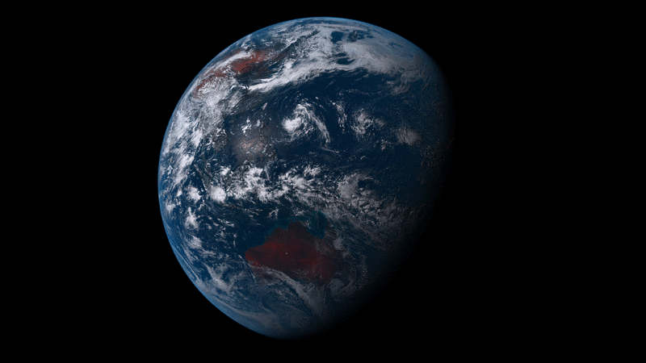

# 💻 wallpapper / wallpapper-exif


[](ttps://developer.apple.com/swift/)
[](https://swift.org/package-manager/)
[](https://developer.apple.com/swift/)


This is simple console application for macOS to create dynamic wallpapers introduced in macOS Mojave. [Here](https://www.youtube.com/watch?v=TVqfPzdsbzY) you can watch how dynamic wallpapers works. Also you can read more about dynamic wallpapers in following articles:

- [macOS Mojave dynamic wallpaper](https://itnext.io/macos-mojave-dynamic-wallpaper-fd26b0698223)
- [macOS Mojave dynamic wallpapers (II)](https://itnext.io/macos-mojave-dynamic-wallpapers-ii-f8b1e55c82f)
- [macOS Mojave dynamic wallpapers (III)](https://itnext.io/macos-mojave-wallpaper-iii-c747c30935c4)

## Examples

Below you can download prepared dynamic wallpapers:

- Earth view ([download](https://www.dropbox.com/s/kd2g59qswchsd0v/Earth%20View.heic?dl=0))


- Cyberpunk 2077 ([download](https://www.dropbox.com/s/54iupz5kmveh61j/cyberpunk-01.heic?dl=0))


## Build and install

You need to have latest XCode (10.2) and Swift 5 installed.

### Homebrew

Open your terminal and run following commands.

```bash
brew tap mczachurski/wallpapper
brew install wallpapper
```

### Manually

Open your terminal and run following commands.

```bash
$ git clone https://github.com/mczachurski/wallpapper.git
$ cd wallpapper
$ swift build --configuration release
$ sudo cp .build/release/wallpapper /usr/local/bin
$ sudo cp .build/release/wallpapper-exif /usr/local/bin
```

If you are using swift in version 4.1, please edit `Package.swift` file and put there your version of swift (in first line).

Also you can build using `build.sh` script (it uses `swiftc` instead Swift CLI).

```bash
$ git clone https://github.com/mczachurski/wallpapper.git
$ cd wallpapper
$ ./build.sh
$ sudo cp .output/wallpapper /usr/local/bin
$ sudo cp .output/wallpapper-exif /usr/local/bin
```

Now in the console you can run `wallpapper -h` and you should got a response similar to the following one.

```bash
wallpapper: [command_option] [-i jsonFile] [-e heicFile]
Command options are:
 -h            show this message and exit
 -v            show program version and exit
 -o            output file name (default is 'output.heic')
 -i            input .json file with wallpaper description
 -e            input .heic file to extract metadata
```

That's all. Now you can build your own dynamic wallpappers.

### Troubleshooting

If you get an error during the Swift build portion of install, try downloading the entire Xcode IDE (not just the tools) from the app store. Then run 

```bash
sudo xcode-select -s /Applications/Xcode.app/Contents/Developer 
```

and run the installation command again.

## Getting started

If you have done above commands now you can build dynamic wallpaper. It's really easy. First you have to put all you pictures into one folder and in the same folder create `json` file with picture's description. Application support three kinds of dynamic wallpapers. 

### Solar

For wallpaper which based on solar coordinates `json` file have to have structure like on below snippet.

```json
[
  {
    "fileName": "1.png",
    "isPrimary": true,
    "isForLight": true,
    "altitude": 27.95,
    "azimuth": 279.66
  },
  {
    "fileName": "2.png",
    "altitude": -31.05,
    "azimuth": 4.16
  },
  ...
  {
    "fileName": "16.png",
    "isForDark": true,
    "altitude": -28.63,
    "azimuth": 340.41
  }
]
```

Properties:

- `fileName` - name of picture file name (you can use same file for few nodes).
- `isPrimary` - information about image which is primary image (it will be visible after creating `heic` file). Only one of the file can be primary.
- `isForLight` - if `true` picture will be displayed when user chose "Light (static)" wallpaper
- `isForDark` - if `true` picture will be displayed when user chose "Dark (static)" wallpaper
- `altitude` - is the angle between the Sun and the observer's local horizon.
- `azimuth` - that is the angle of the Sun around the horizon.

To calculate proper altitude and azimuth you can use `wallpapper-exif` application or web page: [https://keisan.casio.com/exec/system/1224682277](https://keisan.casio.com/exec/system/1224682277). In web page you have to put place where you take a photo and the date. Then system generate for you altitude and azimuth of the Sun during whole day.

### Time

For wallpaper which based on OS time `json` file have to have structure like on below snippet.

```json
[
    {
        "fileName": "1.png",
        "isPrimary": true,
        "isForLight": true,
        "time": "2012-04-23T10:25:43Z"
    },
    {
        "fileName": "2.png",
        "time": "2012-04-23T14:32:12Z"
    },
    {
        "fileName": "3.png",
        "time": "2012-04-23T18:12:01Z"
    },
    {
        "fileName": "4.png",
        "isForDark": true,
        "time": "2012-04-23T20:10:45Z"
    }
]
```

Properties:

- `fileName` - name of picture file name (you can use same file for few nodes).
- `isPrimary` - information about image which is primary image (it will be visible after creating `heic` file). Only one of the file can be primary.
- `isForLight` - if `true` picture will be displayed when user chose "Light (static)" wallpaper
- `isForDark` - if `true` picture will be displayed when user chose "Dark (static)" wallpaper
- `time` - time when wallpaper will be changed (most important is hour).

### Apperance

For wallpapers based on OS apperance settings (light/dark) we have to prepare much simpler JSON file, and we have to use only two images (one for light and one for dark theme). 

```json
[
    {
        "fileName": "1.png",
        "isPrimary": true,
        "isForLight": true
    },
    {
        "fileName": "2.png",
        "isForDark": true
    }
]
```

Properties:

- `fileName` - name of picture file name.
- `isPrimary` - information about image which is primary image (it will be visible after creating `heic` file). Only one of the file can be primary.
- `isForLight` - if `true` picture will be displayed when user uses light theme
- `isForDark` - if `true` picture will be displayed when user uses dark theme

### Preparing wallpapers

When you have `json` file and all pictures then you can generate `heic` file. You have to run following command:

```bash
wallpapper -i wallpapper.json
```

You should got a new file: `output.heic`. Set this file as a new wallpaper and enjoy you own dynamic wallpaper! 

### Extracting metadata

You can extract metadata from existing `heic` file. You have to run following command:

```bash
wallpapper -e Catalina.heic
```

Metadata should be printed as output on the console.

### Calculating sun position

If your photos contains GPS Exif metadata and creation time you can use `wallpapper-exif` application to generate `json` file with Sun `altitude` and `azimuth`. Example application usage:

```bash
$ wallpapper-exif 1.jpeg 2.jpeg 3.jpeg
```

`json` should be produced as output on the console.

Sun calculations has been created based on the [JavaScript library](https://github.com/mourner/suncalc) created by [Vladimir Agafonkin](http://agafonkin.com/en) ([@mourner](https://github.com/mourner)).
