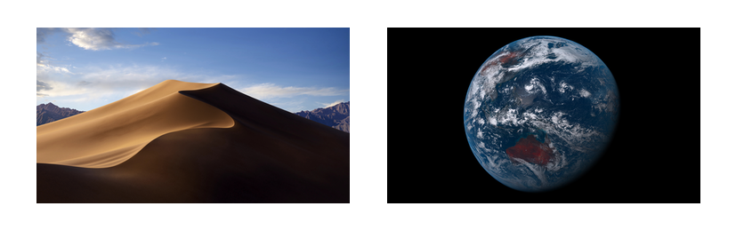
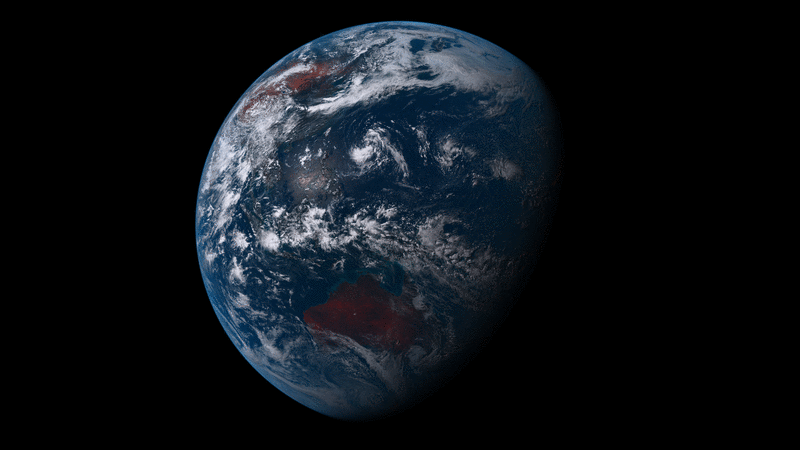

# 💻 wallpapper / wallpapper-exif


[](ttps://developer.apple.com/swift/)
[](https://swift.org/package-manager/)
[](https://developer.apple.com/swift/)



This is a simple console application for macOS to create the dynamic wallpapers introduced in macOS Mojave. [Here](https://www.youtube.com/watch?v=TVqfPzdsbzY) you can watch how dynamic wallpapers work. Also, you can read more about dynamic wallpapers in the following articles:

- [macOS Mojave dynamic wallpaper](https://itnext.io/macos-mojave-dynamic-wallpaper-fd26b0698223)
- [macOS Mojave dynamic wallpapers (II)](https://itnext.io/macos-mojave-dynamic-wallpapers-ii-f8b1e55c82f)
- [macOS Mojave dynamic wallpapers (III)](https://itnext.io/macos-mojave-wallpaper-iii-c747c30935c4)

## Examples

Below you can download prepared dynamic wallpapers:

- Earth view ([download](https://www.dropbox.com/s/kd2g59qswchsd0v/Earth%20View.heic?dl=0))


- Cyberpunk 2077 ([download](https://www.dropbox.com/s/54iupz5kmveh61j/cyberpunk-01.heic?dl=0))


## Build and install

You need to have the latest Xcode (10.2) and Swift 5 installed.

### Homebrew

Open your terminal and run the following commands.

```bash
brew tap mczachurski/wallpapper
brew install wallpapper
```

### Manually

Open your terminal and run the following commands.

```bash
$ git clone https://github.com/mczachurski/wallpapper.git
$ cd wallpapper
$ swift build --configuration release
$ sudo cp .build/release/wallpapper /usr/local/bin
$ sudo cp .build/release/wallpapper-exif /usr/local/bin
```

If you are using Swift version 4.1, please edit the `Package.swift` file and put your version of Swift (on the first line).

Also, you can build using the `build.sh` script (it uses `swiftc` instead of the Swift CLI).

```bash
$ git clone https://github.com/mczachurski/wallpapper.git
$ cd wallpapper
$ ./build.sh
$ sudo cp .output/wallpapper /usr/local/bin
$ sudo cp .output/wallpapper-exif /usr/local/bin
```

Now in the console you can run `wallpapper -h` and you should get a response similar to the following one.

```bash
wallpapper: [command_option] [-i jsonFile] [-e heicFile]
Command options are:
 -h            show this message and exit
 -v            show program version and exit
 -o            output file name (default is 'output.heic')
 -i            input .json file with wallpaper description
 -e            input .heic file to extract metadata
 -q            quality of the output images (default is 1.0)
```

That's all. Now you can build your own dynamic wallpapers.

### Troubleshooting

If you get an error during the Swift build portion of the install, try downloading the entire Xcode IDE (not just the tools) from the App Store. Then run 

```bash
sudo xcode-select -s /Applications/Xcode.app/Contents/Developer 
```

and run the installation command again.

## Getting started

If you have done the above commands, now you can build a dynamic wallpaper. It's really easy. First, you have to put all your pictures into one folder and, in the same folder, create a `json` file with the pictures' descriptions. The application supports three kinds of dynamic wallpapers. 

### Solar

For a wallpaper that is based on solar coordinates, the `json` file has to have a structure like the snippet below.

```json
[
  {
    "fileName": "1.png",
    "isPrimary": true,
    "isForLight": true,
    "altitude": 27.95,
    "azimuth": 279.66
  },
  {
    "fileName": "2.png",
    "altitude": -31.05,
    "azimuth": 4.16
  },
  ...
  {
    "fileName": "16.png",
    "isForDark": true,
    "altitude": -28.63,
    "azimuth": 340.41
  }
]
```

Properties:

- `fileName` - name of the picture file (you can use the same file for a few nodes).
- `isPrimary` - information about the image that is the primary image (it will be visible after creating the `heic` file). Only one of the files can be primary.
- `isForLight` - if `true`, the picture will be displayed when the user chooses "Light (static)" wallpaper
- `isForDark` - if `true`, the picture will be displayed when the user chooses "Dark (static)" wallpaper
- `altitude` - is the angle between the Sun and the observer's local horizon.
- `azimuth` - that is the angle of the Sun around the horizon.

To calculate proper altitude and azimuth, you can use the `wallpapper-exif` application or a web page: [https://gml.noaa.gov/grad/solcalc/azel.html](https://gml.noaa.gov/grad/solcalc/azel.html) or [https://www.omnicalculator.com/physics/sun-angle](https://www.omnicalculator.com/physics/sun-angle). On the web page, you have to enter the place where you take a photo and the date. Then the system generates for you the altitude and azimuth of the Sun during the whole day.

### Time

For a wallpaper that is based on the OS time `json` file have to have a structure like the snippet below.

```json
[
    {
        "fileName": "1.png",
        "isPrimary": true,
        "isForLight": true,
        "time": "10:25:43"
    },
    {
        "fileName": "2.png",
        "time": "14:32:12"
    },
    {
        "fileName": "3.png",
        "time": "18:12:01"
    },
    {
        "fileName": "4.png",
        "isForDark": true,
        "time": "20:10:45"
    }
]
```

Properties:

- `fileName` - name of picture file (you can use the same file for a few nodes).
- `isPrimary` - information about the image that is the primary image (it will be visible after creating the `heic` file). Only one of the files can be primary.
- `isForLight` - if `true`, the picture will be displayed when the user chooses "Light (static)" wallpaper
- `isForDark` - if `true`, the picture will be displayed when the user chooses "Dark (static)" wallpaper
- `time` - time when wallpaper will be changed (most important is hour).

### Appearance

For wallpapers based on OS appearance settings (light/dark), we have to prepare a much simpler JSON file, and we have to use only two images (one for light and one for dark theme). 

```json
[
    {
        "fileName": "1.png",
        "isPrimary": true,
        "isForLight": true
    },
    {
        "fileName": "2.png",
        "isForDark": true
    }
]
```

Properties:

- `fileName` - name of the picture file.
- `isPrimary` - information about the image that is the primary image (it will be visible after creating the `heic` file). Only one of the files can be primary.
- `isForLight` - if `true`, the picture will be displayed when the user uses the light theme
- `isForDark` - if `true`, the picture will be displayed when the user uses the dark theme

### Preparing wallpapers

When you have a `json` file and all pictures, then you can generate a `heic` file. You have to run the following command:

```bash
wallpapper -i wallpapper.json
```

You should get a new file: `output.heic`. Set this file as a new wallpaper and enjoy your own dynamic wallpaper! 

### Extracting metadata

You can extract metadata from an existing `heic` file. You have to run the following command:

```bash
wallpapper -e Catalina.heic
```

Metadata should be printed as output on the console.

Also, it's possible to extract and save the whole `plist` file:

```bash
wallpapper -e Catalina.heic -o output.plist
```

### Calculating sun position

If your photos contain GPS Exif metadata and creation time, you can use the `wallpapper-exif` application to generate a `json` file with Sun `altitude` and `azimuth`. Example application usage:

```bash
$ wallpapper-exif 1.jpeg 2.jpeg 3.jpeg
```

`json` should be produced as output on the console.

Sun calculations have been created based on the [JavaScript library](https://github.com/mourner/suncalc) created by [Vladimir Agafonkin](http://agafonkin.com/en) ([@mourner](https://github.com/mourner)).
